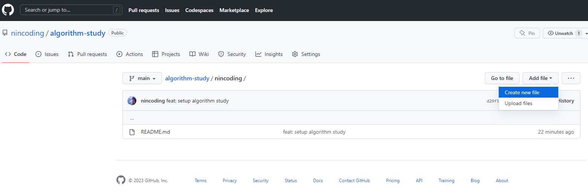
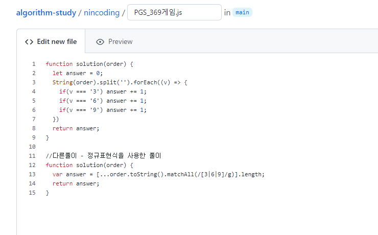
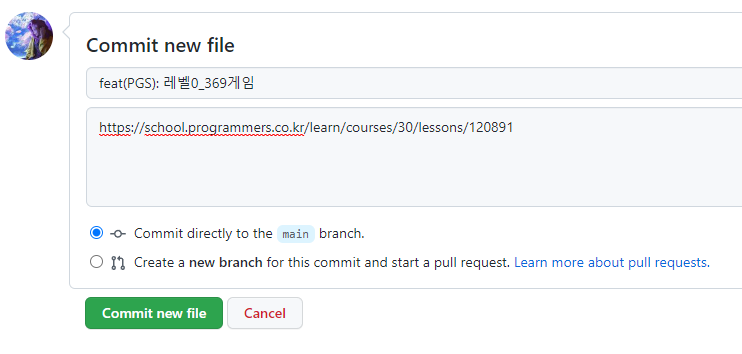
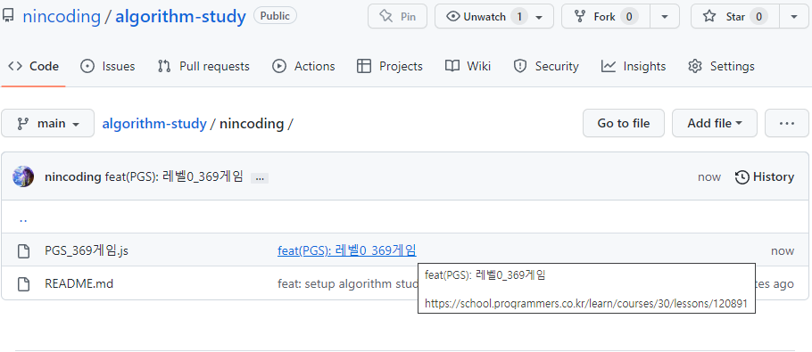

# 🌱 **GUI방식 파일 업로드 하는 방법**

깃허브 GUI를 이용하여 원격 저장소에 바로 파일을 업로드할 수 있다.

1. 자신의 폴더로 들어가서 우측상단의 Add file 클릭 → Create new file 클릭

1. 파일명을 `플랫폼_문제제목.js`식으로 작성  (`weeklyIssue 폴더`에서는 `플랫폼_문제제목.md` )
2. 본문에 풀이한 소스 코드 작성

1. Commit new file 윗부분에 형식에 맞게 제목작성
2. 아래 부분엔 해당 문제의 링크 첨부
3. Commit new file 클릭

**해당 파일이 업로드 된 것을 볼 수 있음**

동일한 방식으로 weeklyIssue 폴더에서의 파일을 컨벤션에 맞게 추가한다.