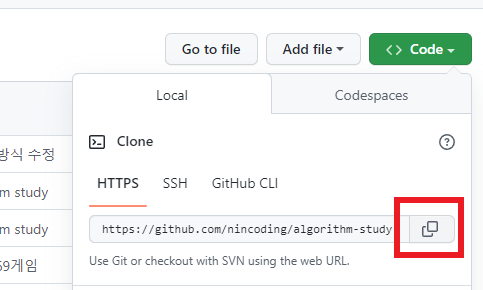
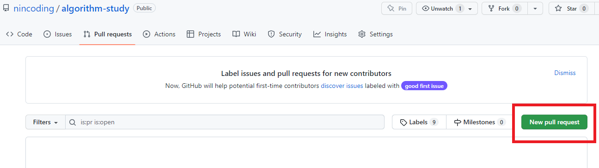

# 🌱 PR**방식 파일 업로드 하는 방법**

1. 이 저장소를 `Fork` 한다.
2. 자신의 깃허브 저장소에 들어가서 fork한 저장소를 자신의 로컬pc로 `Clone` 해온다.



3. git을 이용해서 아래와 같이 복사한 주소를 clone 한다.

```
$ git clone https://github.com/자신의깃허브명/algorithm-study.git
```

4. 원격 저장소 remote 설정하기


> 💡 fork한 저장소를 **원격 저장소의 최신 커밋**으로 내용을 변경하기 위해 remote 설정

- clone 한 저장소에 원격 저장소 설정하기(PR 보낼 저장소를 추가하는 것)
- 원격 저장소 git 주소는 PR 보낼 저장소를 의미한다.
- 원격 저장소의 이름을 `upstream` 으로 설정한다.

```
$ git remote add upstream https://github.com/nincoding/algorithm-study.git
```

5. 아래의 명령어로 remote 설정이 완료되었는지 확인한다.

```
$ git remote -v

> origin https://github.com/자신의깃허브명/algorithm-study.git (fetch)
> origin https://github.com/자신의깃허브명/algorithm-study.git (push)
> upstream https://github.com/nincoding/algorithm-study.git (fetch)
> upstream https://github.com/nincoding/algorithm-study.git (push)
```

6. PR용 새로운 브랜치를 생성한다.
- 아래의 명령어로 PR을 내보내고 작업할 branch를 생성한다.
- branch 이름은 자신의 깃허브명으로 생성한다.

```
$ git checkout -b 자신의깃허브명
```

7. VSCode 등 추가할 파일 작업을 마친 후 저장 한 뒤 `add & commit` 한다.
- git add. 을 입력하면 현재 작업 후 저장된 모든 파일을 선택함
- git add 특정파일명 을 입력하면 특정파일만 선택가능
- git commit -m 뒤에는 커밋 컨벤션에 맞게 작성한다.

```
$ git add.
$ git commit -m "컨벤션에 맞게 작성한다."
```

8. 자신이 생성한 브랜치에 `push` 한다.
- 브랜치명은 main 이 아닌 PR용으로 새롭게 생성한 자신의 브랜치명으로 입력한다.

```
$ git push origin 자신의깃허브명
```

9. 깃허브에서 PR(Pull Request)을 보낸다.
- PR을 한번 보내면 close를 하지않아도 push한 파일들이 자동 반영된다.



- compare: 가 자신의 브랜치명인지 확인한다.
- 제목 작성시 `[자신의이름] n주차_n문제` 로 작성하고 Create pull request 버튼을 클릭한다.


> 💡 //예시 [한수지] 1주차_3문제

10. PR 승인 확인 후 동기화 및 브랜치 삭제
- PR이 원격 저장소에서 승인되어 원격 저장소에 merge가 되었다면 작업 끝난 branch는 삭제한다.
- 아래 명령어로 원격 저장소와 로컬 저장소의 코드를 동기화한다.

```
$ git pull upstream main
```

- 아래 명령어로 각각 local 과 remote branch를 삭제한다. (자신의깃허브명으로 생성된 브랜치명)

```
$ git branch -D 자신의깃허브명
$ git push origin --delete 자신의깃허브명
```