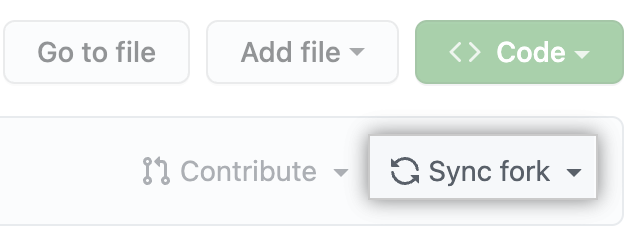
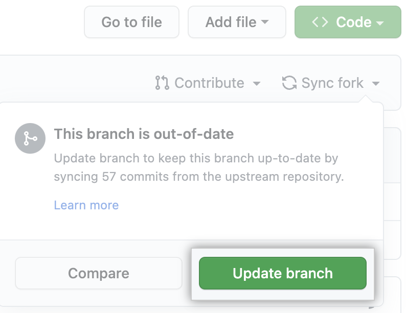

# 🌱 fork한 저장소 **동기화 방법**

아래 두 가지 방법 중 편한 방법으로 진행해 주세요.


## 😃 **Github에서 Web UI로 확인**

### 동기화 확인
- github에서 fork한 저장소를 들어가 아래 사진과 같이 동기화 설정



### fetch & merge (=full 최신 커밋 내역 가져오기)




## 😃 **명령어로 확인**

### 동기화 확인
- remote 설정 확인

```
$ git remote -v
```

- 아래와 같이 나온다면, 원격 저장소 설정이 되지 않은 상태

```
> origin  https://github.com/YOUR_USERNAME/YOUR_FORK.git (fetch)
> origin  https://github.com/YOUR_USERNAME/YOUR_FORK.git (push)
```

- 아래 명령어를 통해 원격 저장소에 PR을 보낼 저장소를 설정

```
$ git remote add upstream https://github.com/ORIGIN_OWNER/ORIGIN_REPO.git
```

- 설정 확인

```
$ git remote -v
> origin    https://github.com/YOUR_USERNAME/YOUR_FORK.git (fetch)
> origin    https://github.com/YOUR_USERNAME/YOUR_FORK.git (push)
> upstream  https://github.com/ORIGINAL_OWNER/ORIGINAL_REPOSITORY.git (fetch)
> upstream  https://github.com/ORIGINAL_OWNER/ORIGINAL_REPOSITORY.git (push)
```

### **fetch & merge (=full 최신 커밋 내역 가져오기)**

1. 최신 커밋 내역 가져오기**

- 아래와 같이 `git fetch upstream` 명령어 입력

```
$ git fetch upstream
> remote: Counting objects: 75, done.
> remote: Compressing objects: 100% (53/53), done.
> remote: Total 62 (delta 27), reused 44 (delta 9)
> Unpacking objects: 100% (62/62), done.
> From https://github.com/ORIGINAL_OWNER/ORIGINAL_REPOSITORY
>  * [new branch]      main     -> upstream/main>
```

- `upstream` 저장소(PR을 보낼 저장소)에서 `main` 브랜치를 통해 최신 커밋 내역을 가져옴

2. main브랜치 확인

- 현재 branch가 `main`이 아닌 다른 branch라면 `main`으로 변경 후 진행해 주세요
- `main` branch로 `merge` 하기 위함

```
$ git checkout main
```

3. 로컬 저장소에 병합하기

- 위에서 `fetch`를 통해 가져온 최신 커밋 내역을 로컬 저장소에 반영하기 위해 `merge`하기
- 아래와 같이 `git merge upstream/main` 명령어 입력

```
//예시
$ git merge upstream/main
> Updating a422352..5fdff0f
> Fast-forward
>  README                    |    9 -------
>  README.md                 |    7 ++++++
>  2 files changed, 7 insertions(+), 9 deletions(-)
>  delete mode 100644 README
>  create mode 100644 README.md
```

4.  fork한 원격 저장소에 적용

지금까지 작업을 통해 PR을 보낼 저장소에서 최신 커밋 내역을 로컬 저장소로 불러왔다면, 이제 `push`를 통해 fork한 원격 저장소에 최신화 적용하기

```
$ git push origin main
```